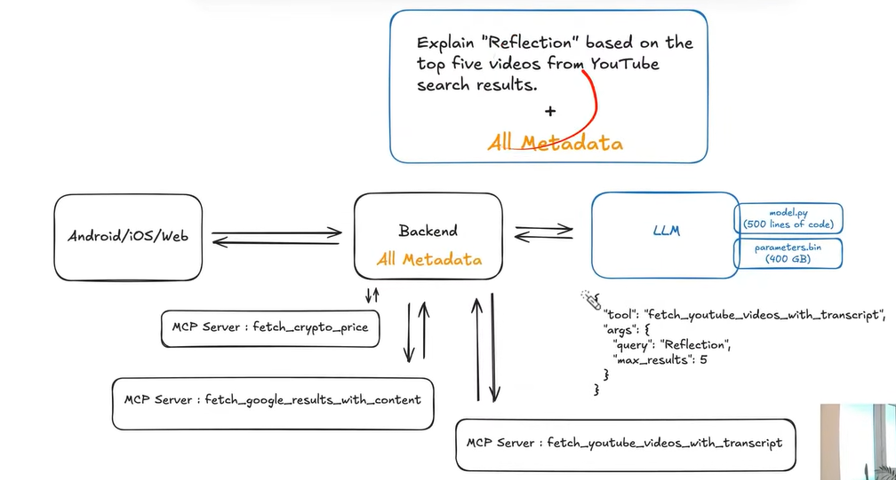

# Model Context Protocol (MCP)

## 📌 Core Idea

### 🧠 Definition
**Model Context Protocol (MCP)** is an open-source standard for connecting AI applications to external systems.

---

## 🔗 Key Analogy

> **What HTTP is for the web, MCP is for AI context.**

- **HTTP**
  - Connects browsers ↔ servers  
  - Enables web communication  

- **MCP**
  - Connects AI models ↔ external tools/data  
  - Enables context-aware AI  

---

## 🎯 What This Means

- MCP allows AI systems to:
  - Access real-time data
  - Use external APIs
  - Interact with tools

- It standardizes how:
  - Tools are defined  
  - Data is passed  
  - AI interacts with external systems  

---

## 🧩 One-Line Summary

> MCP = **Standard protocol that gives AI access to real-world context**

# 📊 MCP Architecture Diagram (Full Flow Explanation)

This diagram shows the **end-to-end architecture of how MCP works in a real system**.

---

# 📊 MCP Architecture Diagram (Detailed Explanation)

This diagram represents the **complete working architecture of MCP (Model Context Protocol)** in a real-world AI system.

---

## 🧠 Core Idea of the Diagram

The system is designed such that:

- The **LLM does not directly access tools**
- The **Backend acts as an orchestrator**
- **MCP Servers act as modular tools**
- **Metadata enables decision making**

---

## 🧱 1. Components in the Architecture

### 📱 Client Layer (Android / iOS / Web)

- This is where the user interacts with the system
- Sends the query to backend

Example user query:

    Explain "Reflection" based on the top five videos from YouTube search results

---

### ⚙️ Backend (Orchestrator with ALL Metadata)

- Central control unit of the system
- Stores metadata of all MCP tools

Responsibilities:
- Receives user query
- Sends query + metadata to LLM
- Executes tool calls
- Returns final response

Important:

    Backend contains ALL metadata of tools

---

### 🧠 LLM (Decision Engine)

- Does NOT call APIs directly
- Uses metadata to decide which tool to use

Internally consists of:

- model.py (logic ~500 lines)
- parameters.bin (~400GB trained weights)

LLM generates tool call like:

    {
      "tool": "fetch_youtube_videos_with_transcript",
      "args": {
        "query": "Reflection",
        "max_results": 5
      }
    }

---

### 🔌 MCP Servers (Tool Layer)

Independent services exposed via MCP

Examples:

    MCP Server : fetch_crypto_price
    MCP Server : fetch_google_results_with_content
    MCP Server : fetch_youtube_videos_with_transcript

Each MCP Server:
- Has metadata (name, description, input schema)
- Executes specific task
- Returns structured output

---

## 🔄 2. End-to-End Flow

### 🟢 Step 1: User → Backend

User sends:

    Explain "Reflection" based on top 5 YouTube videos

---

### 🟡 Step 2: Backend → LLM

Backend sends:

    {
      "query": "Explain Reflection",
      "metadata": "ALL AVAILABLE TOOLS METADATA"
    }

Key point:
LLM now knows ALL tools it can use

---

### 🔵 Step 3: LLM Decision

LLM analyzes query and selects tool:

    {
      "tool": "fetch_youtube_videos_with_transcript",
      "args": {
        "query": "Reflection",
        "max_results": 5
      }
    }

---

### 🟣 Step 4: Backend Executes Tool

Backend calls:

    fetch_youtube_videos_with_transcript(query="Reflection", max_results=5)

---

### 🟠 Step 5: MCP Server Response

Tool returns:

    {
      "videos": [
        { "title": "...", "transcript": "..." },
        { "title": "...", "transcript": "..." }
      ]
    }

---

### 🔴 Step 6: LLM Final Response

Backend sends tool output back to LLM

LLM generates final answer using:
- Tool data
- Its reasoning capability

---

## 🔁 3. Full Data Flow

    User
      ↓
    Backend
      ↓
    LLM (decides tool)
      ↓
    Backend
      ↓
    MCP Tool
      ↓
    Backend
      ↓
    LLM (final answer)
      ↓
    Backend
      ↓
    User

---

## ⚠️ 4. Critical Concepts from Diagram

### 🔑 1. "All Metadata" is VERY Important

- Metadata tells LLM:
  - What tools exist
  - What they do
  - How to use them

Without metadata:
- LLM cannot call tools

---

### 🔑 2. LLM is NOT an Executor

LLM:
- Thinks
- Decides
- Generates

Backend:
- Executes
- Controls flow

---

### 🔑 3. Tools are Plug-and-Play

- New MCP servers can be added easily
- No need to retrain LLM

---

## 🚀 5. Why This Architecture is Powerful

### ❌ Without MCP

- Hardcoded API calls
- Tight coupling
- Not scalable

---

### ✅ With MCP

- Dynamic tool usage
- Clean separation of concerns
- Scalable and modular system

---

## 🧠 Final Summary

This diagram shows a **production-grade AI architecture** where:

- Backend = Orchestrator + Metadata Manager  
- LLM = Decision + Reasoning Engine  
- MCP Servers = Execution Layer  
- Metadata = Communication Bridge  

Final Insight:

    MCP transforms AI from a static model
    into a dynamic system that can interact with the real world
Together, they enable **real-world AI applications**

# 📊 MCP + RAG Architecture (Solving Slow Response & Context Window Issues)

This diagram explains how **MCP + Retrieval Augmented Generation (RAG)** solves:

- 🐢 Slow responses  
- 📦 Context window limitations of LLMs  

---

## 🚨 1. Problem Highlighted in Diagram

### ❌ Issues

1. **Slow Response**
   - Fetching full PDFs or large data → high latency

2. **Context Window Limit**
   - LLM cannot process entire documents (token limit)

---

## 🧠 2. High-Level Idea of Solution

Instead of sending full data to LLM:

👉 We:
- Break data into chunks  
- Convert into embeddings  
- Store in Vector DB  
- Retrieve only relevant parts  

---

## 🧱 3. Components in Architecture

### 📱 Client

    Android / iOS / Web

- Sends query

---

### ⚙️ Backend (All Metadata)

- Stores MCP tool metadata
- Orchestrates:
  - LLM calls
  - Tool execution
  - Data flow

---

### 🧠 LLM

- Decision maker
- Generates:
  - Tool calls
  - Final answers

---

### 🔌 MCP Servers

#### Tools shown:

    fetch_crypto_price
    fetch_google_results_with_content
    fetch_youtube_videos_with_transcript
    fetch_pdf_content (old approach)
    ingest_and_query_pdf (optimized RAG approach)

---

### 📄 PDF Storage

- Stores raw documents

---

### 🧠 Vector Database (VectorDB)

- Stores embeddings of chunks
- Enables similarity search

---

## 🔄 4. OLD APPROACH (Problematic)

### Flow:

    User → Backend → LLM → fetch_pdf_content → Full PDF → LLM

### ❌ Problems:

- Entire PDF sent to LLM
- High token usage
- Slow response
- Context overflow

---

## 🚀 5. NEW APPROACH (RAG + MCP)

### Step 1: Document Processing (Offline)

#### Convert PDF → Chunks

    PDF → chunk1, chunk2, chunk3 ...

---

#### Generate Embeddings

Each chunk converted to vector:

    chunk1 → [0.18, 0.52, -0.10]
    chunk2 → [0.40, -0.12, 0.33]
    chunk3 → [0.43, -0.13, 0.30]

---

#### Store in VectorDB

    {
      chunk: 1,
      pdf_id: "physics",
      embedding: [0.18, 0.52, -0.10],
      text: "..."
    }

---

### Step 2: Query Time Flow

#### 🟢 User Query

    "Reflection"

---

#### 🟡 Convert Query → Embedding

    "Reflection" → [0.41, -0.14, 0.36]

---

#### 🔵 Vector Search (Similarity Lookup)

    embedding → VectorDB → nearest chunks

Result:

    [
      { chunk: 2, text: "Reflection law..." },
      { chunk: 3, text: "Angle of incidence..." }
    ]

---

#### 🟣 Send ONLY Relevant Data to LLM

Instead of full PDF:

    context = [chunk2, chunk3]

---

#### 🔴 LLM Generates Answer

Using:
- Retrieved chunks
- Its knowledge

---

## 🔁 6. Updated MCP Flow with RAG

    User
      ↓
    Backend
      ↓
    LLM (decides tool)
      ↓
    Backend
      ↓
    MCP Tool: ingest_and_query_pdf
      ↓
    VectorDB (retrieval)
      ↓
    Backend
      ↓
    LLM (final answer)
      ↓
    User

---

## 🔑 7. Key Improvements

### ⚡ Faster Response
- Only small relevant chunks fetched

---

### 📦 Reduced Context Usage
- Avoid sending full documents

---

### 🎯 Better Accuracy
- Focused, relevant information

---

### 🔌 Scalable System
- Works for large datasets

---

## ⚠️ 8. Important Concepts

### 🧠 Embeddings

- Numerical representation of text
- Captures semantic meaning

---

### 🔍 Similarity Search

- Finds closest meaning vectors
- Not keyword-based → meaning-based

---

### 📚 Chunking

- Splits large data into manageable pieces

---

## 🆕 9. New MCP Tool

Instead of:

    fetch_pdf_content

We use:

    ingest_and_query_pdf

👉 This tool:
- Handles chunking
- Embeddings
- Retrieval

---

## 🧠 Final Summary

This diagram shows evolution:

### ❌ Before
- Direct data → LLM  
- Slow + inefficient  

### ✅ After (MCP + RAG)
- Smart retrieval → LLM  
- Fast + scalable  

---

## 🚀 One-Line Insight

    "Don’t send all data to LLM — send only what matters"
