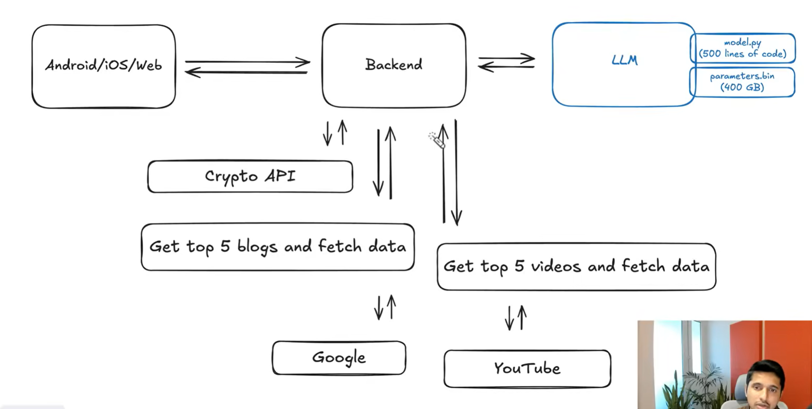

## RAG: Use an External Source for Updated Information

### Retrieval-Augmented Generation

**Retrieval →** Fetching relevant information from an external source  
(docs, database, web)

**Augmented →** Adding that retrieved information to the model’s context

**Generation →** Producing the final answer using both:
- the model’s knowledge  
- the retrieved data
  
## RAG Architecture Explained (Based on Diagram)

This diagram shows how a real-world **RAG (Retrieval-Augmented Generation)** system works with an LLM + external data sources.

---

## 🧩 1. Frontend (Client Layer)
Android / iOS / Web

- User sends a query (e.g., "Latest crypto trends")
- Request is sent to backend

---

## ⚙️ 2. Backend (Orchestrator)
The backend is the **brain of the system**

Responsibilities:
- Receives user query
- Decides what external data is needed
- Calls APIs (Google, YouTube, Crypto API)
- Sends enriched data to LLM

---

## 🤖 3. LLM (Core Model)
- model.py → architecture (Transformer)
- parameters.bin → trained weights

LLM does NOT fetch real-time data  
It only generates answers based on:
- its training
- + extra context from backend (RAG)

---

## 🌐 4. External Data Sources (Retrieval Layer)

### a) Crypto API
- Fetches real-time crypto data

### b) Google (Blogs / Articles)
Backend:
→ "Get top 5 blogs and fetch data"

### c) YouTube (Videos)
Backend:
→ "Get top 5 videos and fetch data"

👉 These sources provide **fresh + relevant information**

---

## 🔄 5. Retrieval Flow

User Query
↓
Backend receives request
↓
Backend calls:
- Crypto API
- Google (blogs)
- YouTube (videos)
↓
Collects relevant data

---

## ➕ 6. Augmentation

Backend combines:
- User query
- Retrieved data (blogs, videos, APIs)

Creates a **rich prompt**

Example:
"User asked X. Here are top articles + videos + data..."

---

## 🧠 7. Generation (LLM)

LLM receives:
- Original query
- Retrieved context

Then generates:
→ Accurate + updated + contextual response

---

## 🔁 8. Final Flow

User (App)
↓
Backend
↓
Retrieve data (Google, YouTube, APIs)
↓
Augment prompt
↓
LLM
↓
Response
↓
User

---

## 🔑 Key Insight

Without RAG:
- LLM = static knowledge (can be outdated)

With RAG:
- LLM + Real-time data = accurate + current answers

---

## ⚡ Simple Analogy

LLM = Smart student  
RAG = Open-book exam  

Instead of relying only on memory,  
the model can **look up information before answering**

---
## ⚠️ Limitation of Basic RAG Architecture

In the previous setup:
- Backend manually handles:
  - API calls (Google, YouTube, Crypto, etc.)
  - Data fetching logic
  - Prompt construction

👉 Problem:
We **cannot build custom backend logic for every possible user request**

- Too many integrations
- Hard to scale
- Not flexible for dynamic queries
- High development & maintenance cost

---

## 🚀 Solution: MCP (Model Context Protocol)

To solve this, we use **MCP (Model Context Protocol)**

### What MCP Does
- Standardizes how LLM interacts with external tools
- Removes need for hardcoded backend logic
- Allows model to dynamically:
  - Discover tools
  - Call APIs
  - Fetch data

---

## 🔄 Updated Flow with MCP

User
↓
LLM
↓
MCP Layer
↓
Tools / APIs (Google, YouTube, Crypto, DB)
↓
Return data
↓
LLM generates response

---

## 🧠 Key Idea

Instead of:
❌ Backend manually deciding everything  

We move to:
✅ LLM + MCP automatically handling tool usage  

---

## ⚡ Analogy

Without MCP:
- Backend = middleman doing everything manually  

With MCP:
- LLM = smart agent  
- MCP = standardized toolbox  

---

## 🔑 Summary

- RAG + Backend → Works but not scalable  
- MCP → Makes system **dynamic, scalable, and extensible**

---
